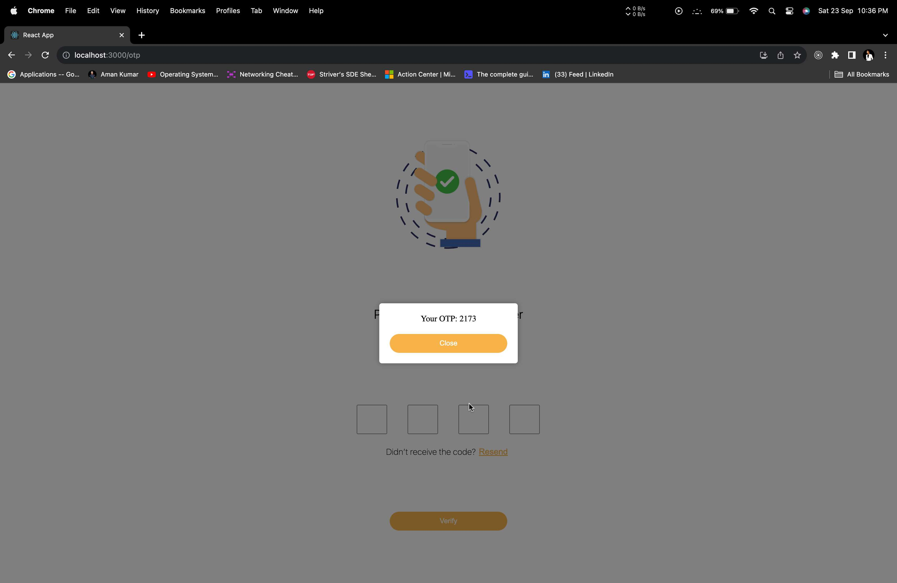
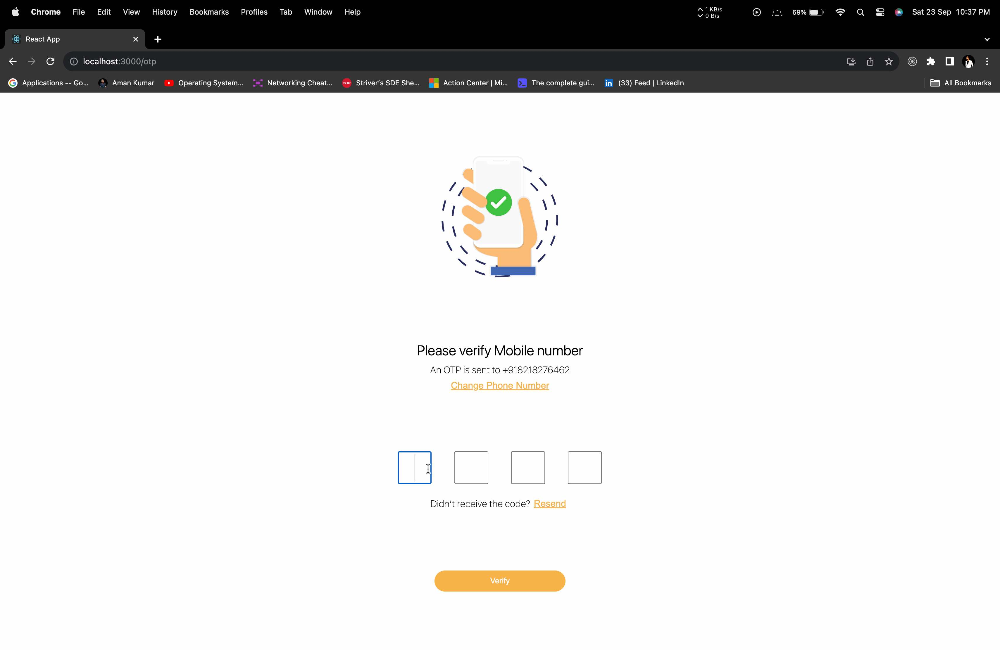

# OTP Verification Client

The OTP Verification Client is the front-end component of a dummy application designed for OTP (One-Time Password) verification. This application closely follows a Figma design, featuring three distinct screens:

1. **Mobile Number Screen (SignIn.jsx)**
2. **OTP Verification Screen (Otp.jsx)**
3. **Success Screen (Success.jsx)**

The backend of the server is not deployed on any website that's why I have used local server for the api call. Both repo (otp-verification-client, otp-verification-server) needs to be in the local to run perfectly.

## Key Features

- **Responsive Design**: The application is designed to be responsive, ensuring a consistent user experience across various devices, including laptops, mobile phones, and tablets.

- **Technology Stack**: OTP Verification Client is built using a combination of modern web technologies, including ReactJS, Git, HTML, CSS, and JavaScript. It also utilizes various React libraries such as axios, libphonenumber-js, react-router-dom, and styled-components.

## Screenshots

### Mobile Number Screen (SignIn.jsx)


- Users can input their phone number, which accepts only numeric values with a maximum length of 10 digits.


- A custom dropdown displays country codes along with the flags of respective countries.

### OTP Verification Screen (Otp.jsx)



- When users enter their phone number, a pop-up displays the OTP (One-Time Password) will cone on otp screen if phone number is valid.


- Users have the option to change their phone number, resend the OTP for a new code, and each new OTP is different.

### Success Screen (Success.jsx)


- OTP is verified, and if correct, users are redirected to the success screen.

## Getting Started

To run the application locally, follow these steps:

1. Clone the repository:
   ```shell
   git clone https://github.com/amankumar-2001/otp-verification-client.git
   ```

2. Navigate to the project directory:
   ```shell
   cd otp-verification-client
   ```

3. Install dependencies:
   ```shell
   npm install
   ```

4. Start the application:
   ```shell
   npm start
   ```

## Author

- [Aman Kumar](https://www.github.com/amankumar-2001)
