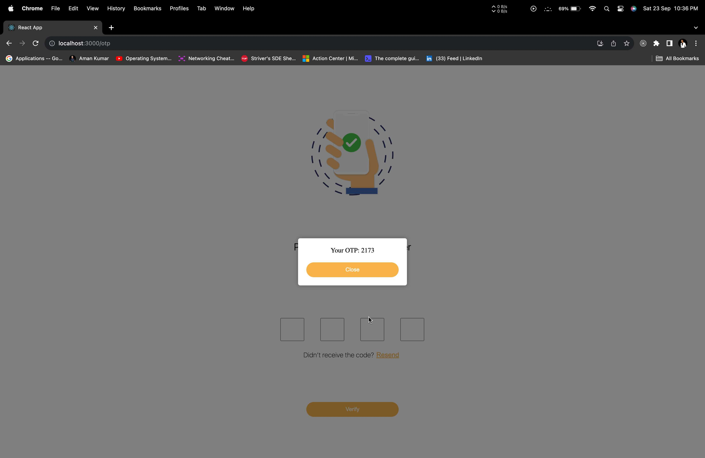
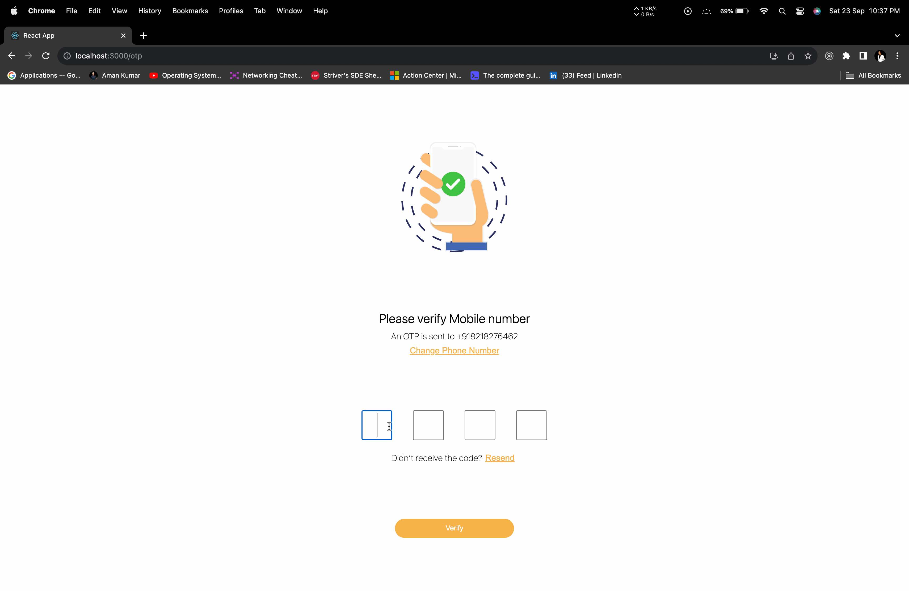
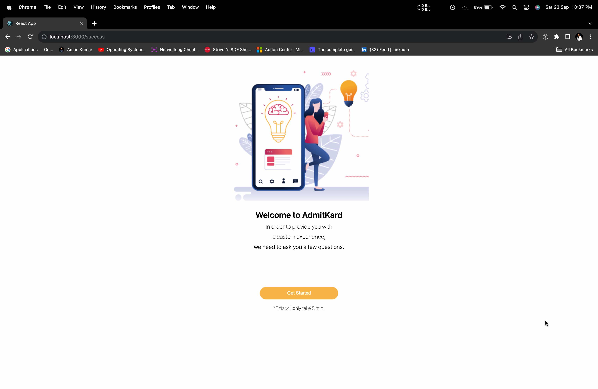

# otp-verification-client

- otp-verification-client is a frontend part of a dummy application capable of otp-verification.
- Application has same design corresponding to figma design.
- The App has 3 screens:
  Screen-1: Mobile Number Screen(SignIn.jsx)  
  Screen-2: OTP Verification Screen(Otp.jsx)  
  Screen-3: Success Screen(Success.jsx)  
- The backend of the server is not deployed on any website that's why I have used local server for the api call.
- Both repo (otp-verification-client, otp-verification-server) needs to be in the local to run perfectly.
- The app has responsive Design across multiple devices like laptop, mobile, tablet, etc.
- Techs Involved - ReactJS | Git | HTML | CSS | JavaScript
- React Library include: axios | libphonenumber-js | react-router-dom | styled-components

### Detailed Design

- Built the app using react functional components with hooks to handle state and other life cycle methods
- Kept the layout of the application simple to have any modification or enhancement in the future to evolve the layout as required
- Screen-1: Mobile Number Screen(SignIn.jsx)
- ### SignIn.jsx
  
- The phone number input text can take number as input only and max. length can be 10.
  
- It has custom dropdown that shows the country code along with the flag of that country.
- I have used "libphonenumber-js" library to validate the phone number.
- I have used "styled-components" library for the css.

- Whenever the user enters the OTP screen the number a popup comes up that shows the OTP

- We can change the phone number that redirect to "SignIn.jsx" screen
- We can also ask to resend the otp and the new otp will be different.

- OTP is verified if it is wrong a popup will be shown otherwise redirect to success screen.

## How to Run the Application:

Clone the repo and set up the application

- git clone [https://github.com/amankumar-2001/otp-verification-client](https://github.com/amankumar-2001/otp-verification-client.git)
- cd otp-verification-client
- npm install
- npm start

## Author

- [@amankumar-2001](https://www.github.com/amankumar-2001)
